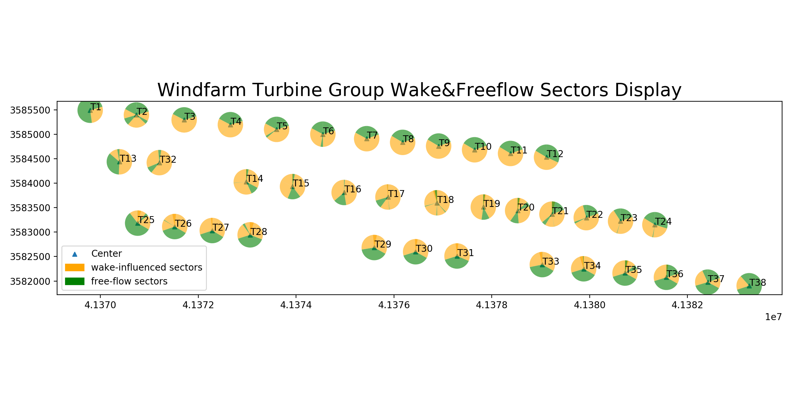

# windTurbine_wake_effect_analysis

Wake influence analysis on wind turbine（single or group), helping to determin the free-flow or wake-affected sectors
based on IEC61400-12.

Some of the main results are listed below:

## Plot Output

1. Example of windfarm turbine sites display

2. Example of single turbine free-flow sector(s) display

3. Example of single turbine wake-influenced sector(s) display
    

4. Example of single turbine wake-influenced sector(s) &free-flow sector(s) display

     

5. WindFarm turbine group free-flow sectors display
   

6. WindFarm turbine group wake-influenced sectors display
   

7. windFarm wake-influenced sector(s) &free-flow sector(s) display

   

   

## Analysis Output
1. Example of analysis output files

2. Example of detailed-analysis-result on single WTG

3. Example of detailed-analysis-result on WTG group(Summary)

